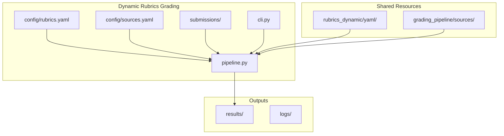

# Dynamic Rubrics Grading Pipeline

## Overview

Create a new grading pipeline at `grading_dynamic_rubrics/` that:

- **Reuses and extends** existing code from [`grading_pipeline/`](grading_pipeline/) and [`grader/`](grader/)
- Uses dynamic rubrics from [`rubrics_dynamic/yaml/`](rubrics_dynamic/yaml/)
- Processes only questions where rubrics exist (q01, q02 currently)
- Uses in-memory vector stores for performance
- Maintains directory separation but **imports shared functionality**

**Philosophy**: Don't reinvent the wheel - import and extend existing modules where possible, only create new code for dynamic rubric-specific features.

## Architecture



## Directory Structure

New `grading_dynamic_rubrics/` folder with:

- `config/` - Configuration files (rubrics.yaml, sources.yaml)
- `submissions/` - New submissions directory (empty initially)
- `pipeline.py` - Core grading logic adapted from grading_pipeline
- `cli.py` - Command-line interface
- `submission_loader.py` - Load submissions
- `config_loader.py` - Load configurations
- `results/` - Grading output (created at runtime)
- `logs/` - Optional logging output

## Key Files to Create/Adapt

### 1. Config Files

**[grading_dynamic_rubrics/config/rubrics.yaml](grading_dynamic_rubrics/config/rubrics.yaml)**

- Maps question IDs to dynamic rubric paths
- Points to `../../rubrics_dynamic/yaml/q0X.yaml`
- Only includes questions with existing rubrics (q01, q02)

**[grading_dynamic_rubrics/config/sources.yaml](grading_dynamic_rubrics/config/sources.yaml)**

- Copy from [`grading_pipeline/config/sources.yaml`](grading_pipeline/config/sources.yaml)
- No changes needed (same source documents, index definitions)

### 2. Core Pipeline Modules

**[grading_dynamic_rubrics/pipeline.py](grading_dynamic_rubrics/pipeline.py)**

Strategy: **Import and wrap** existing functions, only override what's different:

```python
# Import existing functions
from grading_pipeline.pipeline import (
    setup_grading_environment,
    grade_question_batch as _grade_question_batch_base,
    write_results,
)

# Create wrapper that forces in-memory backend
def grade_question_batch(...):
    return _grade_question_batch_base(..., index_backend="in-memory")
```

New code needed:

- **`apply_rubric_scoring_dynamic()`** - Two-dimensional scoring function
- **`_grade_student_core_dynamic()`** - Modified version that uses dynamic scoring
- Wrapper functions that set in-memory defaults

Reuse directly:

- `setup_grading_environment()` - Works as-is with in-memory backend
- `write_results()` - No changes needed
- `build_or_update_indexes_for_backend()` - Already supports in-memory

**[grading_dynamic_rubrics/submission_loader.py](grading_dynamic_rubrics/submission_loader.py)**

Strategy: **Direct import** - no changes needed:

```python
# Simply re-export from grading_pipeline
from grading_pipeline.submission_loader import (
    load_submission,
    load_all_submissions_for_question,
)
```

**[grading_dynamic_rubrics/config_loader.py](grading_dynamic_rubrics/config_loader.py)**

Strategy: **Direct import** - no changes needed:

```python
# Simply re-export from grading_pipeline
from grading_pipeline.config_loader import (
    load_rubric_config,
    get_rubric_path,
)
```

**[grading_dynamic_rubrics/cli.py](grading_dynamic_rubrics/cli.py)**

Strategy: **Import and simplify** - reuse validation and command structure:

```python
# Import shared functions
from grading_pipeline.cli import validate_paths

# Import our wrapped pipeline functions
from grading_dynamic_rubrics.pipeline import (
    grade_question_batch,
    grade_single_student,
    write_results,
)
```

Changes from [`grading_pipeline/cli.py`](grading_pipeline/cli.py):

- Remove `--index-backend` argument (always in-memory)
- Remove `--index-dir` argument (not needed)
- Update help text to mention dynamic rubrics
- Keep same command structure: `grade-question` and `grade-student`

### 3. Supporting Files

**[grading_dynamic_rubrics/__init__.py](grading_dynamic_rubrics/__init__.py)** - Empty module marker

**[grading_dynamic_rubrics/README.md](grading_dynamic_rubrics/README.md)** - Documentation covering:

- Purpose: Grade with LLM-generated dynamic rubrics
- Rubric format differences from static rubrics
- Usage examples
- How to add new questions

## Pytest Tests

Create comprehensive tests in [`tests/`](tests/):

**[tests/test_dynamic_config_loader.py](tests/test_dynamic_config_loader.py)**

- Load dynamic rubric config
- Resolve paths to `rubrics_dynamic/yaml/`
- Handle missing questions gracefully
- Validate rubric structure matches dynamic schema

**[tests/test_dynamic_pipeline.py](tests/test_dynamic_pipeline.py)**

- Test in-memory index building
- Test `setup_grading_environment()` with dynamic rubrics
- Test `grade_question_batch()` with mock submissions
- Verify results format
- Error handling for missing rubrics

**[tests/test_dynamic_submission_loader.py](tests/test_dynamic_submission_loader.py)**

- Load submissions from `grading_dynamic_rubrics/submissions/`
- Group by question_id
- Validate submission format

**[tests/test_dynamic_cli.py](tests/test_dynamic_cli.py)**

- CLI argument parsing
- Grade-question command
- Grade-student command
- Error messages for missing rubrics

## Implementation Details

### Dynamic Rubric Schema Differences

Dynamic rubrics (from LLM) include additional fields not in static rubrics:

- `scoring_weights` - Keyword vs semantic weighting per criterion (e.g., `{keyword: 0.5, semantic: 0.5}`)
- `semantic_decay` - Decay function for semantic scoring (e.g., `linear`)
- `semantic_top_k` - Number of evidence chunks to consider (e.g., `5`)
- More detailed criterion descriptions

### Two-Dimensional Scoring Implementation

**CRITICAL**: Dynamic rubrics require two-dimensional scoring that combines keyword and semantic scores.

Current [`grading_pipeline/pipeline.py`](grading_pipeline/pipeline.py) uses `apply_rubric_scoring()` which **only does keyword matching**. For dynamic rubrics, we need:

```python
# For each criterion:
dimension_score = (keyword_weight × keyword_score + semantic_weight × semantic_score) × max_points
```

Where:

- `keyword_score` (0-1): Based on keyword matches in student answer
- `semantic_score` (0-1): Based on semantic similarity of retrieved evidence chunks
- `keyword_weight` and `semantic_weight`: From rubric's `scoring_weights` (typically 0.5 each)
- `max_points`: Points allocated to the criterion

**Implementation approach**:

1. Create new `apply_rubric_scoring_dynamic()` function in pipeline.py
2. Extract keyword scoring logic from existing `apply_rubric_scoring()`
3. Add semantic scoring using evidence similarity scores
4. Apply `semantic_decay` and `semantic_top_k` from rubric
5. Combine using weights from `scoring_weights`

**Reference**: See [`CURRENT_GRADING_STRATEGY.md`](CURRENT_GRADING_STRATEGY.md) for detailed scoring formula and examples.

### In-Memory Index Strategy

Use [`grading_pipeline/index_builder_in_memory.py`](grading_pipeline/index_builder_in_memory.py):

- Import `build_or_update_dual_indexes_in_memory()`
- No persist directory needed
- Fast startup, no disk I/O
- Rebuild indexes on each run (acceptable for small document sets)

### Rubric Availability Check

Before grading:

1. Load requested question IDs
2. Check which rubrics exist in `rubrics_dynamic/yaml/`
3. Only process intersection of requested and available
4. Warn about missing rubrics

### Submission Format

Maintain compatibility with existing submission format from [`grading_pipeline/submissions/`](grading_pipeline/submissions/):

```yaml
student_id: student_001
question_id: q01
question_text: "..."
answer: "..."
rubric_version: "1.0"
metadata:
  answer_type: good
```

## CLI Usage Pattern

Following the pattern from [`grading_pipeline/GRADING_README.md`](grading_pipeline/GRADING_README.md):

```bash
# Basic command structure
uv run python -m grading_dynamic_rubrics.cli grade-question \
    --question q01 \
    --rubrics-config grading_dynamic_rubrics/config/rubrics.yaml \
    --submissions-dir grading_dynamic_rubrics/submissions \
    --sources-config grading_dynamic_rubrics/config/sources.yaml \
    --output grading_dynamic_rubrics/results/q01_results.json

# Note: No --index-dir or --index-backend flags (always in-memory)
```

Key differences from static rubrics pipeline:

- No `--index-dir` flag (in-memory only)
- No `--index-backend` flag (always in-memory)
- Points to `grading_dynamic_rubrics/` directories
- Uses dynamic rubrics from `rubrics_dynamic/yaml/`

## Testing Strategy

1. **Unit tests** - Individual module functionality
2. **Integration tests** - Full pipeline with mock LLM
3. **Manual testing** - Create sample submissions for q01, q02
4. Use `tests/tmp_chroma_indexes/dynamic_grading/` for test artifacts
5. Follow cleanup strategy from [`tests/test_config.yaml`](tests/test_config.yaml)
6. **Scoring validation** - Verify keyword+semantic scores combine correctly per `scoring_weights`

## Code Reuse Strategy

**Import directly** (no changes):

- `grading_pipeline.submission_loader` - Submission loading logic
- `grading_pipeline.config_loader` - Config loading logic
- `grading_pipeline.pipeline.write_results()` - Results writing
- `grading_pipeline.pipeline.setup_grading_environment()` - Index setup
- `grading_pipeline.cli.validate_paths()` - Path validation

**Extend/wrap** (minimal changes):

- `grading_pipeline.pipeline.grade_question_batch()` - Wrap to force in-memory
- `grading_pipeline.pipeline._grade_student_core()` - Override scoring logic
- `grading_pipeline.cli.main()` - Simplify arguments for in-memory only

**Create new** (dynamic rubric-specific):

- `apply_rubric_scoring_dynamic()` - Two-dimensional scoring
- Dynamic rubric field handling (`scoring_weights`, `semantic_decay`, `semantic_top_k`)

## Success Criteria

- ✅ Maximum code reuse from existing modules
- ✅ Pipeline grades submissions using dynamic rubrics (q01, q02)
- ✅ Two-dimensional scoring (keyword + semantic) correctly implemented
- ✅ Dynamic rubric fields properly utilized
- ✅ In-memory indexes work without persistence
- ✅ CLI provides user-friendly interface
- ✅ All pytest tests pass
- ✅ Clear error messages for missing rubrics
- ✅ Directory separation maintained
- ✅ Documentation explains usage and differences from static rubrics