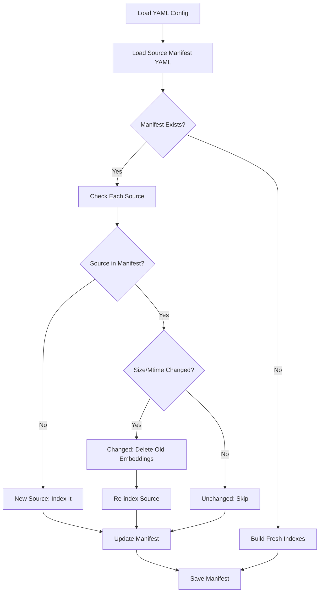

# Incremental Indexing for Version2

## Overview

Implement smart incremental indexing that tracks which sources have been indexed and only processes new or changed sources. When a source file changes (detected via file size + modification time), delete its old embeddings and re-index.

## Problem Statement

Currently, `build_dual_indexes()` always reprocesses all sources:

- Wastes time re-indexing unchanged PDFs
- Can create duplicate embeddings if run multiple times
- No way to add new sources without rebuilding everything

## Solution Architecture



## Implementation Details

### 1. Source Manifest Structure

Create `source_manifest.yaml` alongside ChromaDB to track indexed sources:

```yaml
version: "1.0"
last_updated: "2024-01-17T12:00:00"
sources:
  file_slides_data_type_quality:
    source_id: "file_slides_data_type_quality"
    file_path: "/path/to/slides_data_type_quality.pdf"
    file_name: "slides_data_type_quality.pdf"
    file_size: 1234567
    file_mtime: 1705497600.0
    source_type: "slide"
    indexed_at: "2024-01-17T12:00:00"
    num_chunks_word: 13
    num_chunks_sentence: 1
```

### 2. Change Detection Logic

```python
def has_source_changed(
    file_path: Path,
    manifest_entry: dict
) -> bool:
    """Check if source file changed via size + mtime."""
    current_size = file_path.stat().st_size
    current_mtime = file_path.stat().st_mtime
    
    return (
        current_size != manifest_entry['file_size'] or
        current_mtime != manifest_entry['file_mtime']
    )
```

### 3. Embedding Deletion by Source

Use ChromaDB's metadata filtering to delete embeddings:

```python
# Delete all embeddings for a specific source_id
collection.delete(where={"source_id": {"$eq": "file_slides_data_type_quality"}})
```

### 4. New Function: `build_or_update_dual_indexes()`

Main entry point that replaces `build_dual_indexes()`:

```python
def build_or_update_dual_indexes(
    config_path: Path,
    persist_dir: Path,
) -> tuple[VectorStoreIndex, VectorStoreIndex]:
    """Build new indexes or incrementally update existing ones.
    
    - Loads source manifest to see what's already indexed
    - Compares sources from YAML to manifest
    - Only indexes new or changed sources
    - Deletes old embeddings before re-indexing changed sources
    - Updates manifest with latest state
    """
```

## Files to Create/Modify

### 1. New: `version2/manifest.py`

Source manifest management functions:

- `load_manifest(persist_dir) -> dict`
- `save_manifest(persist_dir, manifest) -> None`
- `get_source_info(file_path) -> dict` - Extract size, mtime, etc.
- `has_source_changed(file_path, manifest_entry) -> bool`
- `create_manifest_entry(doc, num_chunks_word, num_chunks_sentence) -> dict`

### 2. Modify: `version2/index_builder.py`

Add new functions:

- `delete_source_from_indexes()` - Delete embeddings by source_id
- `add_documents_to_indexes()` - Add new docs to existing indexes
- `build_or_update_dual_indexes()` - Main incremental indexing function
- Update `__main__` to call `build_or_update_dual_indexes()`

### 3. New: `version2/test_incremental_indexing.py`

Comprehensive test suite:

- Test 1: Fresh build (no manifest)
- Test 2: Reload with no changes (skips all)
- Test 3: Add new source (indexes only new one)
- Test 4: Modify existing source (deletes + re-indexes)
- Test 5: Manifest persistence and accuracy

### 4. Move: Test script out of tmp/

- Delete `version2/tmp/test_yaml_loading.py`
- Tests now in `version2/test_incremental_indexing.py`

## Key Implementation Points

### Manifest Location

```
persist_dir/
├── chroma.sqlite3          # ChromaDB data
├── source_manifest.yaml    # NEW: Source tracking
└── ...
```

### ChromaDB Metadata Structure

When creating documents, ensure metadata includes `source_id`:

```python
doc_metadata = {
    "source_id": "file_slides_data_type_quality",  # CRITICAL for deletion
    "source_type": "slide",
    "file_path": str(file_path),
    "file_name": file_path.name,
    ...
}
```

This is already done in `_load_file_source_with_pdf()` (line 136).

### Deletion Process

For each changed source:

1. Get source_id from manifest
2. Delete from word index: `word_collection.delete(where={"source_id": {"$eq": source_id}})`
3. Delete from sentence index: `sentence_collection.delete(where={"source_id": {"$eq": source_id}})`
4. Re-parse and re-embed the source
5. Add new embeddings to both indexes
6. Update manifest entry

### Adding New Documents

Instead of `VectorStoreIndex.from_documents()` (which creates new), use:

```python
# Get existing index
word_index = VectorStoreIndex.from_vector_store(word_vector_store)

# Add new documents incrementally
for doc in new_documents:
    word_index.insert(doc)  # Or similar - check LlamaIndex API
```

## Testing Strategy

### Test Scenario 1: Fresh Build

- No ChromaDB exists
- No manifest exists
- Result: Build everything, create manifest

### Test Scenario 2: No Changes

- ChromaDB + manifest exist
- No sources changed
- Result: Skip all indexing, load existing

### Test Scenario 3: New Source

- Add second PDF to sources/
- Update YAML config
- Result: Only index new PDF, existing unchanged

### Test Scenario 4: Changed Source

- Modify existing PDF (touch to change mtime)
- Result: Delete old embeddings, re-index only that source

### Test Scenario 5: Removed Source

- Remove source from YAML
- Result: Keep embeddings (no automatic cleanup)

## Benefits

1. **Fast Updates**: Only process new/changed sources
2. **No Duplicates**: Smart deletion prevents accumulation
3. **Production Ready**: Can add new lecture slides without full rebuild
4. **Transparent**: Manifest shows what's indexed and when
5. **Efficient**: Typical re-run with no changes takes <1 second

## Code Reuse from Version1

Continue importing from version1:

- `build_word_index()` - For fresh builds
- `build_sentence_index()` - For fresh builds
- `load_dual_indexes()` - For loading existing
- All other version1 functions

Only add incremental indexing logic in version2.

## Migration Path

Existing code using `build_dual_indexes()` can:

1. Keep using it for fresh builds
2. Switch to `build_or_update_dual_indexes()` for incremental updates
3. Both functions coexist - backwards compatible