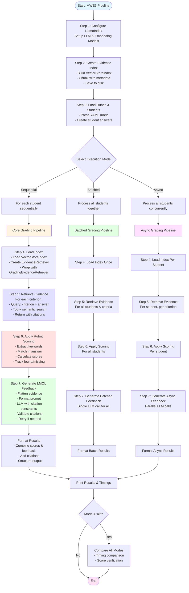

Analyzing the pipeline and comparing it to the Chu et al. paper. Reviewing related files to understand the implementation.

[5 tools called]

Checking the rubric structure:

[2 tools called]

## Detailed Pipeline Description

### Overview
The `mwe5_full_pipeline_2students.py` script implements a RAG-enhanced grading pipeline with three execution modes. It follows the GradeRAG approach from Chu et al., adapted for a single vector index.

### Step-by-Step Pipeline

#### **Step 1: System Configuration** (`setup_grading_environment`)
- Initializes LlamaIndex defaults (embedding model, LLM provider)
- Checks `OLLAMA_NUM_PARALLEL` for concurrent execution
- **Choice**: Uses LlamaIndex's configuration system rather than custom config

#### **Step 2: Evidence Index Creation** (`create_sample_evidence_index`)
- Creates sample evidence corpus with metadata (source_id, source_type, page_number)
- Builds `VectorStoreIndex` using `SimpleVectorStore` (in-memory)
- Uses `SentenceSplitter` with configurable chunk_size (512) and chunk_overlap (50)
- Preserves metadata in document chunks for citation tracking
- **Choice**: Single vector index (not dual-index like Chu et al.)
- **Choice**: In-memory store for development (can switch to Qdrant/Chroma)

#### **Step 3: Rubric and Student Data Preparation**
- Loads rubric from YAML with:
  - `question_id`, `question_text`, `total_points`
  - `criteria` with `criterion_id`, `description`, `points`, `evidence_required`, `evaluation_method`
- Creates multiple student answers for testing
- **Choice**: YAML-based rubric (not JSON or database)

#### **Step 4: Index Loading and Retriever Setup** (`_grade_student_core`)
- Loads saved index from disk (pickled `VectorStoreIndex`)
- Creates `EvidenceRetriever` (base retriever)
- Wraps with `GradingEvidenceRetriever` (grading-specific interface)
- **Choice**: LlamaIndex's `VectorStoreIndex` with semantic similarity search

#### **Step 5: Evidence Retrieval** (`GradingEvidenceRetriever.retrieve_for_rubric`)
- For each rubric criterion with `evidence_required=True`:
  - Constructs query: `"{criterion['description']} {student_answer}"`
  - Retrieves top_k_per_criterion (default: 2) evidence chunks
  - Returns evidence with `source_id`, `text`, `score`, metadata
- **Choice**: Criterion-specific retrieval (not question-level)
- **Choice**: Combines criterion description + student answer in query
- **Difference from paper**: Single index (not dual-index for domain knowledge + scoring rationales)

#### **Step 6: Rubric Scoring** (`apply_rubric_scoring`)
- Deterministic scoring before LLM feedback
- For each criterion:
  - Extracts keywords from description (filters stop words and meta-words)
  - Checks keyword presence in student answer
  - Scores proportionally: `score = (matches / total_keywords) * max_points`
  - Tracks `found_keywords` and `missing_keywords`
- **Choice**: Keyword-based heuristic (not pure LLM scoring)
- **Choice**: Scoring happens before feedback generation (deterministic baseline)

#### **Step 7: LMQL Feedback Generation** (`LMQLGrader.grade_with_feedback`)
- Flattens evidence across criteria (removes duplicates)
- Formats prompt with:
  - Grading record (scores per criterion)
  - Evidence spans with source IDs
  - Student answer
- Generates citation-enforced explanation:
  - LLM must cite evidence for each sentence
  - Validates that all sentences have valid citation IDs
  - Retries up to 3 times if validation fails
- **Choice**: LMQL-style constraints (not pure prompt engineering)
- **Choice**: Citation enforcement via validation loop

### Execution Modes

#### **Mode 1: Sequential** (`run_sequential_mode`)
- Grades students one at a time
- 4 separate LLM calls (one per student)
- Baseline for comparison

#### **Mode 2: Batched** (`run_batched_mode`)
- Grades all students in a single LLM call
- Single prompt with all students' data
- Most efficient (1 LLM call vs 4)

#### **Mode 3: Async Concurrent** (`run_async_concurrent_mode`)
- Grades students concurrently using `asyncio.gather`
- 4 parallel LLM calls
- Requires `OLLAMA_NUM_PARALLEL` for Ollama backend

## Comparison with Chu et al. Paper

### Similarities
1. RAG-enhanced grading: Retrieves domain-specific knowledge
2. Criterion-based retrieval: Evidence retrieved per rubric criterion
3. Expert examples as knowledge: Evidence includes reference materials (though not explicitly "scoring rationales")
4. Semantic search: Uses vector similarity (LlamaIndex embeddings)
5. Citation tracking: Evidence includes source IDs for traceability

### Differences
1. Single index vs dual-index: Paper uses separate indices for domain knowledge and scoring rationales; this uses one unified index
2. No gold standard: Paper includes expert-annotated examples; this does not
3. Scoring method: Paper uses LLM for scoring; this uses keyword-based heuristic before LLM feedback
4. Retrieval strategy: Paper uses adaptive retrieval; this uses fixed top_k per criterion
5. In-context learning: Paper evaluates ICL with 0/3/6 shots; this supports it but doesn't systematically vary shots

## High-Level Flowchart

## Key Design Choices Summary

| Component | Choice | Rationale |
|-----------|--------|-----------|
| **Vector Store** | LlamaIndex `SimpleVectorStore` | Fast iteration, can upgrade to persistent stores |
| **Index Strategy** | Single unified index | Simpler than dual-index, sufficient for MWE |
| **Chunking** | SentenceSplitter (512 chars, 50 overlap) | Balances context preservation with retrieval precision |
| **Retrieval** | Semantic similarity (top-k per criterion) | More flexible than keyword matching |
| **Scoring** | Keyword-based heuristic before LLM | Provides deterministic baseline, LLM adds feedback |
| **Feedback** | LMQL-style citation enforcement | Ensures traceability and accountability |
| **Execution** | Three modes (seq/batch/async) | Flexibility for different use cases and backends |

This implementation provides a practical RAG-enhanced grading system that aligns with the Chu et al. approach while making pragmatic choices for development and deployment.
