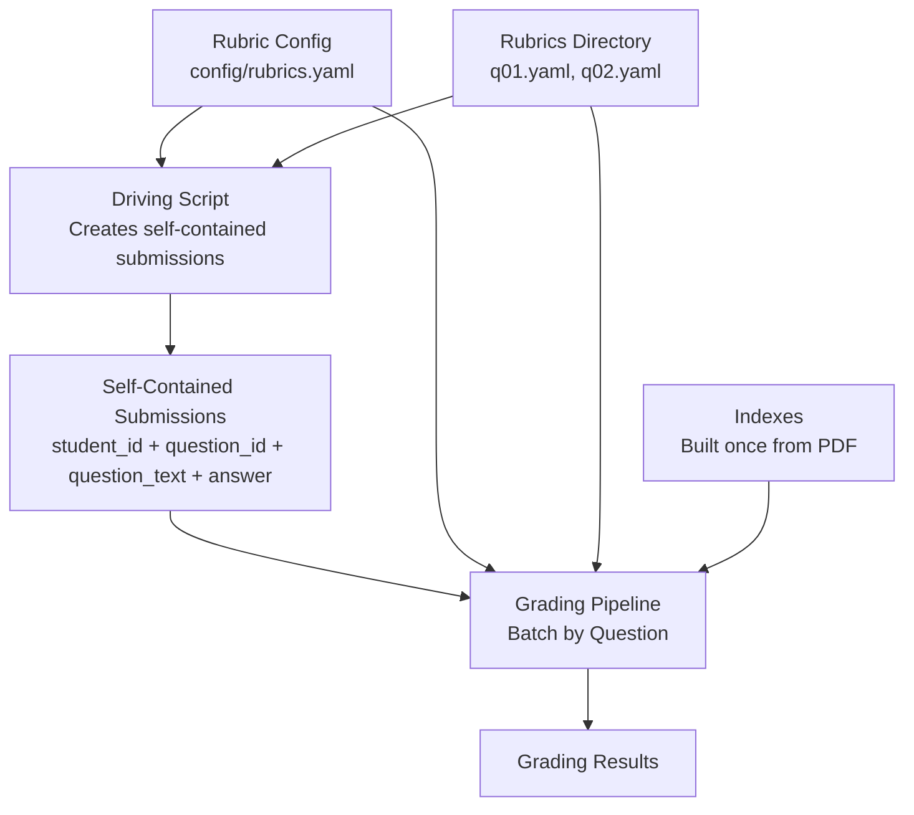
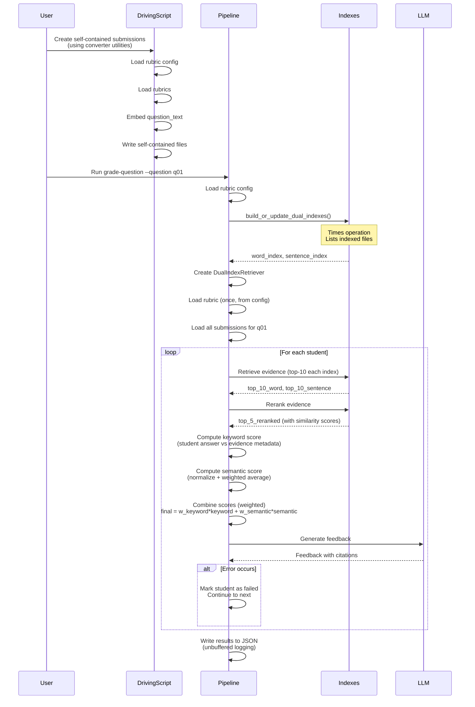
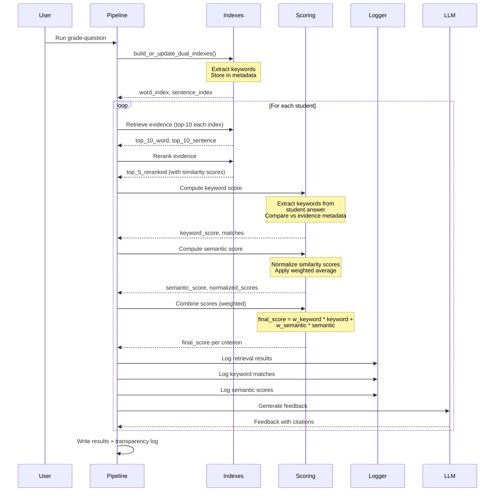

# Grading Pipeline with Batch-by-Question Architecture

## Current State

### Completed Components
- **grading_pipeline/index_builder.py**: Incremental indexing with PDF support, dual indexes (word + sentence)
- **grading_pipeline/manifest.py**: Source tracking and change detection
- **grading_pipeline/test_incremental_indexing.py**: Comprehensive indexing tests
- **retrieval_core/retriever.py**: `DualIndexRetriever` with cross-encoder reranking
- **retrieval_core/pipeline.py**: Full grading pipeline (uses different index setup)
- **grader/grade_question.py**: Core grading logic
- **grader/lmql_grading.py**: LMQL feedback generation

### Single Evidence Source
- **grading_pipeline/sources/slides_data_type_quality.pdf**: Single PDF source, embedded once via incremental indexing

## Architecture Overview

### Submission Data Flow



### Key Design Decisions

1. **Simplified Format System**:
    - **Primary Format**: Self-contained submissions (Option B) only
    - **Location**: `grading_pipeline/submissions/student_XXX_qYY.yaml`
    - **Contains**: `student_id`, `question_id`, `question_text`, `answer`, `rubric_version`, `metadata`
    - **Conversion**: Handled by driving scripts (explicit, user-controlled)
    - **Future**: CLI option for auto-conversion (not now)

2. **Rubric Path Configuration**:
    - **Rubric paths defined in config YAML**: `grading_pipeline/config/rubrics.yaml`
    - **Convention**: `question_id: "q01"` maps to path specified in config
    - **Validation**: Validate rubric exists during grading

3. **Batch-by-Question Processing**:
    - Pipeline processes one question at a time for all students
    - Load rubric once per question (using config)
    - Load/ensure indexes once per question (with timing and file listing)
    - Process all students for that question together
    - Single student is a special case (batch of size 1)

4. **Error Handling**:
    - **Strategy**: Continue on error (don't stop batch on single failure)
    - **Output**: Unbuffered stdout/stderr OR unbuffered writes to log file
    - **Error tracking**: Mark failed students with error details in results

5. **Index Building**:
    - **Automatic**: `build_or_update_dual_indexes()` called automatically on first use
    - **Timing**: Measure and report index building/loading time
    - **Output**: Clearly state which files are being indexed

6. **Optimization Benefits**:
   - Rubric loaded once per question batch
   - Indexes loaded once per question batch
   - Evidence retrieval can be optimized per question
   - Better resource utilization

7. **Two-Dimensional Scoring**:
   - **Keyword Matching**: Extracts keywords from criterion descriptions and student answers, compares against evidence chunk metadata (keywords extracted during indexing)
   - **Semantic Similarity**: Uses RAG-retrieved evidence similarity scores from cross-encoder reranking, normalized per-query and aggregated with rank-based weighting
   - **Combined Score**: Weighted combination of both dimensions (configurable weights in rubric YAML)
   - **Transparency**: Full logging of retrieval results, keyword matches, and semantic scores for student review

## Implementation Plan

### Phase 1: Configuration System

#### 1.1 Rubric Configuration File

**File**: `grading_pipeline/config/rubrics.yaml` (NEW)

```yaml
# Rubric path configuration
rubrics:
  q01:
    path: "grading_pipeline/rubrics/q01.yaml"
    description: "Question 1: Mutual Information"
  q02:
    path: "grading_pipeline/rubrics/q02.yaml"
    description: "Question 2: Data Quality"
```

**Loading Function**:
```python
# grading_pipeline/config_loader.py (NEW)
def load_rubric_config(config_path: Path) -> dict[str, dict[str, str]]:
    """Load rubric configuration.
    
    Returns dict mapping question_id to rubric path and metadata.
    """
    
def get_rubric_path(question_id: str, config_path: Path) -> Path:
    """Get rubric path for a question_id.
    
    Raises ValueError if question_id not found in config.
    """
```

### Phase 2: Submission Data Structure

#### 2.1 Self-Contained Submission Format

**File**: `grading_pipeline/submissions/student_XXX_qYY.yaml`

```yaml
student_id: "student_001"
question_id: "q01"
question_text: "Explain mutual information and its relationship to entropy"
rubric_version: "1.0"
answer: |
  [Student's answer text - can be multi-line]
metadata:
  created_at: "2026-01-17T10:30:00"
  rubric_path: "grading_pipeline/rubrics/q01.yaml"
```

**Schema**:

- `student_id`: String identifier
- `question_id`: String matching a rubric config entry
- `question_text`: Full question text (for spot-checking)
- `rubric_version`: Version from rubric metadata
- `answer`: Multi-line string with student's response
- `metadata.created_at`: Timestamp
- `metadata.rubric_path`: Path to source rubric

#### 2.2 Loading Functions

**File**: `grading_pipeline/submission_loader.py` (NEW)

```python
def load_submission(submission_path: Path) -> dict[str, Any]:
    """Load self-contained submission.
    
    Validates required fields: student_id, question_id, question_text, answer
    """

def load_all_submissions_for_question(
    submissions_dir: Path, question_id: str
) -> list[dict[str, Any]]:
    """Load all submissions for a specific question.
    
    Groups submissions by question_id for batch processing.
    Validates all submissions have matching question_id.
    """
```

### Phase 3: Conversion Utility (Optional, for Driving Script)

#### 3.1 Conversion Functions

**File**: `grading_pipeline/submission_converter.py` (NEW)

**Purpose**: Utility functions for driving script to convert from simple format to self-contained format.

**Function**:
```python
def create_self_contained_submission(
    student_id: str,
    question_id: str,
    answer: str,
    rubrics_config_path: Path
) -> dict[str, Any]:
    """Create self-contained submission from simple inputs.
    
    Loads rubric config, finds rubric file, embeds question_text.
    Returns dict ready to write as YAML.
    
    This is used by driving scripts, not the main pipeline.
    """
```

**Note**: This is a utility for driving scripts. The main pipeline works directly with self-contained submissions.

### Phase 4: Batch-by-Question Grading Pipeline

#### 3.1 Core Pipeline Functions

**File**: `grading_pipeline/pipeline.py` (NEW)

**Main Batch Function**:
```python
def grade_question_batch(
    question_id: str,
    rubric_path: Path,
    submissions: list[dict[str, Any]],
    persist_dir: Path,
    config_path: Path,
    execution_mode: str = "sequential",
    log_file: Path | None = None  # Optional log file
) -> list[dict[str, Any]]:
    """Grade all students for a single question.
    
    Error Handling:
    - Continue on error (don't stop batch)
    - Mark failed students with error field
    - Unbuffered output to stdout or log file
    
    Returns:
        List of grading results, one per student.
        Failed students have {"error": "error message"} instead of full result.
    """
    # Setup logging (unbuffered)
    if log_file:
        log_handle = open(log_file, "w", buffering=1)  # Line buffered
    else:
        log_handle = None
    
    def log_print(msg: str) -> None:
        """Print with unbuffered output."""
        print(msg, flush=True)
        if log_handle:
            log_handle.write(msg + "\n")
            log_handle.flush()
    
    # Setup environment
    retriever, rubric, timing = setup_grading_environment(
        question_id, rubric_path, persist_dir, config_path
    )
    
    results = []
    
    for submission in submissions:
        student_id = submission["student_id"]
        student_answer = submission["answer"]
        
        log_print(f"[Grading] Processing {student_id}...")
        
        try:
            result = _grade_student_core(
                student_id, student_answer, rubric, retriever, ...
            )
            results.append(result)
            log_print(f"[Grading] ✓ {student_id} completed")
        except Exception as e:
            error_msg = f"Error grading {student_id}: {type(e).__name__}: {e}"
            log_print(f"[Grading] ✗ {error_msg}")
            results.append({
                "student_id": student_id,
                "question_id": question_id,
                "error": error_msg
            })
    
    if log_handle:
        log_handle.close()
    
    return results
```

**Results Output**:
```python
def write_results(
    results: list[dict[str, Any]],
    question_id: str,
    output_path: Path,
    per_student: bool = False  # Future: also write per-student files
) -> None:
    """Write grading results to file(s).
    
    Development: One file per question
    Future: Option to write per-student files too
    """
    if per_student:
        # Write individual files
        for result in results:
            if "error" not in result:
                student_id = result["student_id"]
                student_file = output_path.parent / f"{student_id}_{question_id}.json"
                with open(student_file, "w") as f:
                    json.dump(result, f, indent=2)
    
    # Always write batch file
    batch_result = {
        "question_id": question_id,
        "graded_at": datetime.now().isoformat(),
        "total_students": len(results),
        "successful": len([r for r in results if "error" not in r]),
        "failed": len([r for r in results if "error" in r]),
        "students": results
    }
    
    with open(output_path, "w") as f:
        json.dump(batch_result, f, indent=2)
```

**Setup Function with Timing and Index Output**:
```python
def setup_grading_environment(
    question_id: str,
    rubric_path: Path,
    persist_dir: Path,
    config_path: Path
) -> tuple[DualIndexRetriever, dict, dict[str, float]]:
    """Setup grading environment for a question.
    
    - Loads or builds dual indexes (incremental)
    - Times the operation
    - Outputs which files are being indexed
    - Creates DualIndexRetriever
    - Loads rubric
    
    Returns: (retriever, rubric, timing_info)
    """
    import time
    
    print(f"[Index Setup] Building or updating indexes...", flush=True)
    start_time = time.time()
    
    # Build or update indexes
    word_index, sentence_index = build_or_update_dual_indexes(
        config_path, persist_dir
    )
    
    build_time = time.time() - start_time
    
    # Output indexed files (from manifest)
    manifest = load_manifest(persist_dir)
    indexed_files = [
        source["file_path"] 
        for source in manifest.get("sources", {}).values()
    ]
    print(f"[Index Setup] Indexed files:", flush=True)
    for file_path in indexed_files:
        print(f"  - {file_path}", flush=True)
    print(f"[Index Setup] Index ready in {build_time:.2f}s", flush=True)
    
    # Create retriever
    retriever = DualIndexRetriever(word_index, sentence_index)
    
    # Load rubric
    rubric = load_rubric(rubric_path)
    
    timing = {"index_setup": build_time}
    
    return retriever, rubric, timing
```

**Core Grading Function**:
```python
def _grade_student_core(
    student_id: str,
    student_answer: str,
    rubric: dict[str, Any],
    retriever: DualIndexRetriever,
    grade_fn: Callable  # For sync/async flexibility
) -> tuple[str, dict, dict[str, float]]:
    """Core grading logic for a single student.
    
    Reuses logic from retrieval_core/pipeline.py but adapted for grading_pipeline:
    - Uses DualIndexRetriever (already initialized)
    - Retrieves evidence per criterion
    - Applies rubric scoring
    - Generates LMQL feedback
    
    Returns: (student_id, formatted_result, step_timings)
    """
```

**Single Student Wrapper**:
```python
def grade_single_student(
    question_id: str,
    rubric_path: Path,
    submission: dict[str, Any],  # Single self-contained submission
    persist_dir: Path,
    config_path: Path
) -> dict[str, Any]:
    """Grade a single student (wrapper around grade_question_batch).
    
    This is just grade_question_batch with a batch of size 1.
    """
```

#### 3.2 Execution Modes

**Sequential Mode**:

- Process students one at a time
- Simple, easy to debug
- Good for small batches

**Batched Mode**:

- Process all students in a single batch
- Efficient for LLM calls
- Good for medium batches

**Async Mode**:

- Process students concurrently
- Best for large batches
- Maximum throughput

### Phase 5: CLI Interface

#### 5.1 Command-Line Interface

**File**: `grading_pipeline/cli.py` (NEW)

**Commands**:

1. **Grade Question Batch**:
```bash
python -m grading_pipeline.cli grade-question \
  --question q01 \
  --rubrics-config grading_pipeline/config/rubrics.yaml \
  --submissions-dir grading_pipeline/submissions \
  --sources-config grading_pipeline/config/sources.yaml \
  --index-dir grading_pipeline/tmp/chroma_db \
  --output results/q01_results.json \
  [--mode sequential|batched|async] \
  [--log results/q01_grading.log]
```

2. **Grade Single Student**:
```bash
python -m grading_pipeline.cli grade-student \
  --question q01 \
  --rubrics-config grading_pipeline/config/rubrics.yaml \
  --submission grading_pipeline/submissions/student_001_q01.yaml \
  --sources-config grading_pipeline/config/sources.yaml \
  --index-dir grading_pipeline/tmp/chroma_db \
  --output results/student_001_q01.json \
  [--log results/student_001_q01.log]
```

**Validation**:

- Check that submissions exist
- Check that rubric config exists
- Check that referenced rubric files exist
- Validate submission structure (required fields)

### Phase 6: Driving Script (Optional)

#### 6.1 Example Driving Script

**File**: `grading_pipeline/prepare_submissions.py` (NEW, EXAMPLE)

**Purpose**: Example script showing how to convert simple inputs to self-contained submissions.

```python
"""Example driving script for preparing self-contained submissions.

This shows how users can create self-contained submissions from simple inputs.
Users can adapt this script to their workflow.
"""
from pathlib import Path
from grading_pipeline.submission_converter import create_self_contained_submission
import yaml

def prepare_submissions(
    students_data: list[dict],  # [{"student_id": "s1", "question_id": "q01", "answer": "..."}]
    rubrics_config_path: Path,
    output_dir: Path
) -> None:
    """Convert simple student data to self-contained submissions."""
    for student_data in students_data:
        submission = create_self_contained_submission(
            student_data["student_id"],
            student_data["question_id"],
            student_data["answer"],
            rubrics_config_path
        )
        
        output_file = output_dir / f"{submission['student_id']}_{submission['question_id']}.yaml"
        with open(output_file, "w") as f:
            yaml.dump(submission, f)
```

**Note**: This is an example. Users can create their own driving scripts as needed.

### Phase 7: Testing

#### 7.1 Test Files

**File**: `grading_pipeline/test_config_loader.py` (NEW)

- Test rubric config loading
- Test rubric path resolution
- Test validation errors

**File**: `grading_pipeline/test_submission_loader.py` (NEW)

- Test loading self-contained submissions
- Test grouping by question_id
- Test validation (required fields)

**File**: `grading_pipeline/test_submission_converter.py` (NEW)

- Test conversion utility functions
- Test rubric config integration
- Test error handling

**File**: `grading_pipeline/test_pipeline.py` (NEW)

- Test `setup_grading_environment()` with timing and file output
- Test `grade_question_batch()` with multiple students
- Test error handling (continue on error)
- Test unbuffered output
- Test with real PDF source and rubric

#### 7.2 Test Data Structure

```
grading_pipeline/test_data/
├── submissions/              # Self-contained test submissions
│   ├── student_001_q01.yaml
│   └── student_002_q01.yaml
├── rubrics/
│   └── q01.yaml             # Test rubric
└── config/
    └── rubrics.yaml          # Test rubric config
```

### Phase 8: Documentation

#### 8.1 Update README

**File**: `grading_pipeline/README.md` (UPDATE)

Add sections:
- Configuration system (rubric config)
- Submission format (self-contained)
- Batch-by-question grading
- Error handling and logging
- Results format
- CLI usage examples
- Driving scripts (optional conversion)

#### 8.2 Create Examples

**File**: `grading_pipeline/EXAMPLES.md` (NEW)

- Example rubric config
- Example self-contained submission
- Example rubric
- Complete workflow example
- Example driving script
- Spot-checking guide

## File Structure

```
grading_pipeline/
├── submissions/                    # Self-contained submissions (primary format)
│   ├── student_001_q01.yaml
│   └── student_002_q01.yaml
├── rubrics/                        # Shared rubrics
│   └── q01.yaml
├── sources/                         # Evidence sources
│   └── slides_data_type_quality.pdf
├── config/
│   ├── sources.yaml                 # Index configuration
│   └── rubrics.yaml                 # Rubric path configuration
├── tmp/
│   └── chroma_db/                   # Persistent indexes
├── results/                         # Grading results (generated)
│   ├── q01_results.json
│   └── q01_grading.log
├── config_loader.py                 # Rubric config loading
├── submission_loader.py             # Submission loading
├── submission_converter.py          # Optional: Conversion utilities for driving scripts
├── pipeline.py                      # Batch-by-question grading
├── cli.py                           # Command-line interface
├── prepare_submissions.py           # Example driving script (optional)
├── test_config_loader.py            # Config tests
├── test_submission_loader.py        # Loader tests
├── test_submission_converter.py     # Converter tests
├── test_pipeline.py                 # Pipeline tests
├── test_incremental_indexing.py    # EXISTS: Indexing tests
├── index_builder.py                 # EXISTS: Incremental indexing
├── manifest.py                      # EXISTS: Source tracking
├── README.md                        # UPDATE: Add pipeline docs
└── EXAMPLES.md                      # NEW: Usage examples
```

## Workflow Diagram



## Key Implementation Details

### Batch Processing Optimization

1. **Index Loading**: `build_or_update_dual_indexes()` is called once per question batch. If indexes already exist and sources unchanged, this is instant (0.14s).

2. **Rubric Loading**: Rubric is loaded once per question batch, not per student.

3. **Retriever Creation**: `DualIndexRetriever` is created once per question batch and reused for all students.

4. **Evidence Retrieval**: Can be optimized per question (e.g., cache common queries).

### Single Student Case

Single student grading is implemented as:
```python
def grade_single_student(...):
    submissions = [load_self_contained_submission(submission_path)]
    results = grade_question_batch(..., submissions, ...)
    return results[0]  # Return single result
```

This ensures consistency: same code path, same optimizations.

### Error Handling Pattern

```python
results = []
for submission in submissions:
    try:
        result = grade_student(...)
        results.append(result)
    except Exception as e:
        results.append({
            "student_id": submission["student_id"],
            "error": str(e)
        })
        # Continue to next student
```

### Unbuffered Output

All print statements use:
```python
print(message, flush=True)
```

Or for file logging:
```python
log_file = open(path, "w", buffering=1)  # Line buffered
log_file.write(message + "\n")
log_file.flush()
```

### Index Building Output

When building/loading indexes:
```
[Index Setup] Building or updating indexes...
[Index Setup] Indexed files:
  - /path/to/slides_data_type_quality.pdf
[Index Setup] Index ready in 1.09s
```

### Results Format

**Per-Question File** (`q01_results.json`):
```json
{
  "question_id": "q01",
  "graded_at": "2026-01-17T10:30:00",
  "total_students": 10,
  "successful": 9,
  "failed": 1,
  "students": [
    {
      "student_id": "student_001",
      "question_id": "q01",
      "score": 8,
      "max_score": 10,
      "feedback": "...",
      "citations": [...],
      "rubric_items": [...]
    },
    {
      "student_id": "student_002",
      "error": "Error grading student_002: ValueError: ..."
    }
  ]
}
```

### Phase 9: Two-Dimensional Scoring System

#### 9.1 Overview

The grading system uses a two-dimensional scoring approach combining:
1. **Keyword Matching**: Extracts keywords from criterion descriptions and student answers, compares against evidence metadata
2. **Semantic Similarity**: Uses RAG-retrieved evidence similarity scores (from cross-encoder reranking)

**Scoring Formula**:
```
final_score = (w_correctness_keyword * correctness_keyword_score + 
               w_correctness_semantic * correctness_semantic_score) +
              (w_terminology_keyword * terminology_keyword_score + 
               w_terminology_semantic * terminology_semantic_score)
```

Initial weights: 0.25 each (equal weighting across all dimensions).

#### 9.2 Keyword Extraction During Indexing

**File**: `grading_pipeline/index_builder.py` (UPDATE)

**Modification**: Extract domain-relevant keywords from each chunk during indexing and store as metadata.

```python
def _extract_keywords_from_text(text: str) -> list[str]:
    """Extract domain-relevant keywords from text chunk.
    
    Uses existing extract_keywords() function to filter stop words
    and meta-words, keeping substantive domain terms.
    
    Args:
        text: Text chunk content.
        
    Returns:
        List of extracted keywords.
    """
    from grader.grade_question import extract_keywords
    return extract_keywords(text)

def _add_keywords_to_metadata(
    documents: list[Document]
) -> list[Document]:
    """Add extracted keywords to document metadata.
    
    Args:
        documents: List of documents to process.
        
    Returns:
        Documents with keywords added to metadata.
    """
    for doc in documents:
        keywords = _extract_keywords_from_text(doc.text)
        if "keywords" not in doc.metadata:
            doc.metadata["keywords"] = []
        doc.metadata["keywords"].extend(keywords)
        # Deduplicate
        doc.metadata["keywords"] = list(set(doc.metadata["keywords"]))
    return documents
```

**Integration**: Modify `_load_file_source_with_pdf()` and similar functions to call `_add_keywords_to_metadata()` before creating indexes.

#### 9.3 Two-Dimensional Scoring Implementation

**File**: `grader/grade_question.py` (UPDATE)

**New Function**:
```python
def compute_keyword_score(
    student_answer: str,
    evidence_chunks: list[dict[str, Any]],
    criterion_keywords: list[str]
) -> dict[str, Any]:
    """Compute keyword-based score by comparing student answer keywords
    against evidence chunk keywords.
    
    Args:
        student_answer: Student's answer text.
        evidence_chunks: List of retrieved evidence chunks with metadata.
        criterion_keywords: Keywords extracted from criterion description.
        
    Returns:
        Dictionary with keyword_score (0-1), found_keywords, missing_keywords,
        and detailed match information.
    """
    from grader.grade_question import extract_keywords
    
    # Extract keywords from student answer
    student_keywords = set(extract_keywords(student_answer.lower()))
    
    # Collect all keywords from evidence chunks
    evidence_keywords = set()
    for chunk in evidence_chunks:
        chunk_keywords = chunk.get("metadata", {}).get("keywords", [])
        evidence_keywords.update([kw.lower() for kw in chunk_keywords])
    
    # Find matches: keywords that appear in both student answer and evidence
    matched_keywords = student_keywords.intersection(evidence_keywords)
    
    # Also check if criterion keywords appear in student answer
    criterion_matches = [kw for kw in criterion_keywords 
                        if kw.lower() in student_answer.lower()]
    
    # Combine matches
    all_matches = matched_keywords.union(set(criterion_matches))
    all_criterion_keywords = set(criterion_keywords)
    
    # Score: matches / total criterion keywords
    if all_criterion_keywords:
        keyword_score = len(all_matches) / len(all_criterion_keywords)
    else:
        keyword_score = 1.0 if matched_keywords else 0.0
    
    return {
        "keyword_score": min(1.0, keyword_score),  # Cap at 1.0
        "found_keywords": list(all_matches),
        "missing_keywords": list(all_criterion_keywords - all_matches),
        "student_keywords": list(student_keywords),
        "evidence_keywords": list(evidence_keywords),
    }

def compute_semantic_score(
    evidence_chunks: list[dict[str, Any]],
    decay_type: str = "linear",
    top_k: int = 5
) -> dict[str, Any]:
    """Compute semantic similarity score from evidence chunk similarity scores.
    
    Args:
        evidence_chunks: List of evidence chunks with similarity scores.
        decay_type: "linear" or "exponential" for rank-based weighting.
        top_k: Number of top chunks to use for scoring.
        
    Returns:
        Dictionary with semantic_score (0-1), normalized_scores, and weights.
    """
    if not evidence_chunks:
        return {"semantic_score": 0.0, "normalized_scores": [], "weights": []}
    
    # Take top-k chunks
    top_chunks = evidence_chunks[:top_k]
    
    # Extract raw scores
    raw_scores = [chunk.get("score", 0.0) for chunk in top_chunks]
    
    # Normalize per-query to [0, 1]
    if len(raw_scores) == 1:
        # Single chunk: normalize to 1.0 if score > 0, else 0.0
        normalized = [1.0 if raw_scores[0] > 0 else 0.0]
    else:
        min_score = min(raw_scores)
        max_score = max(raw_scores)
        if max_score == min_score:
            normalized = [1.0] * len(raw_scores)
        else:
            normalized = [(s - min_score) / (max_score - min_score) 
                         for s in raw_scores]
    
    # Compute rank-based weights
    if decay_type == "linear":
        # Linear: [1.0, 0.8, 0.6, 0.4, 0.2]
        weights = [max(0.0, 1.0 - (i * 0.2)) for i in range(len(normalized))]
    else:  # exponential
        # Exponential: [1.0, 0.5, 0.25, 0.125, 0.0625]
        weights = [0.5 ** i for i in range(len(normalized))]
    
    # Weighted average
    if sum(weights) > 0:
        semantic_score = sum(n * w for n, w in zip(normalized, weights)) / sum(weights)
    else:
        semantic_score = 0.0
    
    return {
        "semantic_score": semantic_score,
        "normalized_scores": normalized,
        "weights": weights,
        "raw_scores": raw_scores,
    }

def apply_rubric_scoring_two_dimensional(
    rubric: dict[str, Any],
    student_answer: str,
    evidence_by_criterion: dict[str, list[dict[str, Any]]],
    scoring_config: dict[str, Any]
) -> dict[str, dict[str, Any]]:
    """Apply two-dimensional rubric scoring (keywords + semantic similarity).
    
    Args:
        rubric: Rubric dictionary with criteria.
        student_answer: Student's answer text.
        evidence_by_criterion: Evidence retrieved for each criterion.
        scoring_config: Configuration dict with:
            - scoring_weights: Dict of weights per criterion and dimension
            - semantic_decay: "linear" or "exponential"
            - semantic_top_k: Number of evidence chunks to use
            
    Returns:
        Dictionary mapping criterion_id to score information including
        both keyword and semantic scores, plus combined final score.
    """
    from grader.grade_question import extract_keywords
    
    scores = {}
    weights = scoring_config.get("scoring_weights", {})
    semantic_decay = scoring_config.get("semantic_decay", "linear")
    semantic_top_k = scoring_config.get("semantic_top_k", 5)
    
    for criterion in rubric.get("criteria", []):
        criterion_id = criterion["criterion_id"]
        max_points = criterion["points"]
        description = criterion["description"]
        
        # Extract criterion keywords
        criterion_keywords = extract_keywords(description.lower())
        
        # Get evidence for this criterion
        evidence_chunks = evidence_by_criterion.get(criterion_id, [])
        
        # Compute keyword score
        keyword_result = compute_keyword_score(
            student_answer, evidence_chunks, criterion_keywords
        )
        
        # Compute semantic score
        semantic_result = compute_semantic_score(
            evidence_chunks, decay_type=semantic_decay, top_k=semantic_top_k
        )
        
        # Get weights for this criterion
        criterion_weights = weights.get(criterion_id, {})
        w_keyword = criterion_weights.get("keyword", 0.5)
        w_semantic = criterion_weights.get("semantic", 0.5)
        
        # Combine scores
        combined_score = (w_keyword * keyword_result["keyword_score"] + 
                         w_semantic * semantic_result["semantic_score"])
        
        # Scale to max_points
        final_score = int(combined_score * max_points)
        
        scores[criterion_id] = {
            "score": final_score,
            "max_score": max_points,
            "keyword_score": keyword_result["keyword_score"],
            "semantic_score": semantic_result["semantic_score"],
            "keywords": criterion_keywords,
            "found_keywords": keyword_result["found_keywords"],
            "missing_keywords": keyword_result["missing_keywords"],
            "evidence_scores": semantic_result["normalized_scores"],
            "evidence_weights": semantic_result["weights"],
        }
    
    return scores
```

#### 9.4 Updated Rubric Structure

**File**: `rubrics/q01.yaml` or generic rubric (UPDATE)

```yaml
question_id: "generic"
total_points: 10

scoring_weights:
  correctness:
    keyword: 0.25
    semantic: 0.25
  terminology:
    keyword: 0.25
    semantic: 0.25

criteria:
  - criterion_id: "correctness"
    description: "Answer correctly addresses the question and demonstrates understanding"
    points: 5
    evidence_required: true
    evaluation_method: "semantic"
    
  - criterion_id: "terminology"
    description: "Uses domain-specific terminology correctly"
    points: 5
    evidence_required: true
    evaluation_method: "semantic"

metadata:
  course: "CS101"
  assignment: "hw01"
  version: "1.0"
```

#### 9.5 Configuration Updates

**File**: `grading_pipeline/config/sources.yaml` (UPDATE)

```yaml
# ... existing source configuration ...

# Scoring configuration
scoring:
  semantic_weight_decay: "linear"  # or "exponential"
  semantic_top_k: 5  # Number of evidence chunks to use for semantic scoring

# Transparency logging
transparency_logging: true  # Enable detailed logging for student transparency
```

#### 9.6 Transparency Logging

**File**: `grading_pipeline/transparency_logger.py` (NEW)

```python
"""Transparency logging for grading pipeline.

Provides detailed, colored logging to help students understand
how their answers were graded and what evidence was used.
"""

from pathlib import Path
from typing import Any

# ANSI color codes
GREEN = "\033[32m"
YELLOW = "\033[33m"
RED = "\033[31m"
BLUE = "\033[34m"
RESET = "\033[0m"
BOLD = "\033[1m"

class TransparencyLogger:
    """Logger for transparent grading information."""
    
    def __init__(self, log_file: Path, enabled: bool = True):
        """Initialize transparency logger.
        
        Args:
            log_file: Path to log file.
            enabled: Whether logging is enabled.
        """
        self.log_file = log_file
        self.enabled = enabled
        self.handle = None
        if enabled:
            self.handle = open(log_file, "w", buffering=1)
    
    def log_retrieval_results(
        self,
        criterion_id: str,
        top_10_word: list[dict[str, Any]],
        top_10_sentence: list[dict[str, Any]],
        top_5_reranked: list[dict[str, Any]]
    ) -> None:
        """Log retrieval results for a criterion.
        
        Args:
            criterion_id: Criterion identifier.
            top_10_word: Top 10 results from word index.
            top_10_sentence: Top 10 results from sentence index.
            top_5_reranked: Top 5 results after reranking.
        """
        if not self.enabled:
            return
        
        self._write(f"\n{BOLD}{BLUE}=== Retrieval Results for {criterion_id} ==={RESET}\n")
        
        self._write(f"{BOLD}Top 10 from Word Index:{RESET}\n")
        for i, result in enumerate(top_10_word[:10], 1):
            score = result.get("score", 0.0)
            self._write(f"  {i}. Score: {GREEN}{score:.3f}{RESET}\n")
            self._write(f"     Text: {result.get('text', '')[:100]}...\n")
        
        self._write(f"\n{BOLD}Top 10 from Sentence Index:{RESET}\n")
        for i, result in enumerate(top_10_sentence[:10], 1):
            score = result.get("score", 0.0)
            self._write(f"  {i}. Score: {GREEN}{score:.3f}{RESET}\n")
            self._write(f"     Text: {result.get('text', '')[:100]}...\n")
        
        self._write(f"\n{BOLD}Top 5 After Reranking:{RESET}\n")
        for i, result in enumerate(top_5_reranked[:5], 1):
            score = result.get("score", 0.0)
            rerank_score = result.get("rerank_score", score)
            self._write(f"  {i}. Original: {score:.3f}, Reranked: {GREEN}{rerank_score:.3f}{RESET}\n")
            self._write(f"     Text: {result.get('text', '')[:100]}...\n")
    
    def log_keyword_matches(
        self,
        criterion_id: str,
        keyword_result: dict[str, Any]
    ) -> None:
        """Log keyword matching results.
        
        Args:
            criterion_id: Criterion identifier.
            keyword_result: Result from compute_keyword_score().
        """
        if not self.enabled:
            return
        
        self._write(f"\n{BOLD}{BLUE}=== Keyword Analysis for {criterion_id} ==={RESET}\n")
        
        found = keyword_result.get("found_keywords", [])
        missing = keyword_result.get("missing_keywords", [])
        score = keyword_result.get("keyword_score", 0.0)
        
        self._write(f"Keyword Score: {GREEN}{score:.3f}{RESET}\n\n")
        
        self._write(f"{BOLD}Found Keywords:{RESET}\n")
        for kw in found:
            self._write(f"  {GREEN}✓{RESET} {kw}\n")
        
        self._write(f"\n{BOLD}Missing Keywords:{RESET}\n")
        for kw in missing:
            self._write(f"  {RED}✗{RESET} {kw}\n")
    
    def log_semantic_scores(
        self,
        criterion_id: str,
        semantic_result: dict[str, Any]
    ) -> None:
        """Log semantic similarity scores.
        
        Args:
            criterion_id: Criterion identifier.
            semantic_result: Result from compute_semantic_score().
        """
        if not self.enabled:
            return
        
        self._write(f"\n{BOLD}{BLUE}=== Semantic Analysis for {criterion_id} ==={RESET}\n")
        
        score = semantic_result.get("semantic_score", 0.0)
        normalized = semantic_result.get("normalized_scores", [])
        weights = semantic_result.get("weights", [])
        
        self._write(f"Semantic Score: {GREEN}{score:.3f}{RESET}\n\n")
        
        self._write(f"{BOLD}Evidence Chunk Scores:{RESET}\n")
        for i, (norm, weight) in enumerate(zip(normalized, weights), 1):
            self._write(f"  {i}. Normalized: {GREEN}{norm:.3f}{RESET}, "
                       f"Weight: {YELLOW}{weight:.3f}{RESET}\n")
    
    def _write(self, text: str) -> None:
        """Write text to log file."""
        if self.handle:
            # Strip ANSI codes for file (or keep them for terminal viewing)
            self.handle.write(text)
            self.handle.flush()
    
    def close(self) -> None:
        """Close log file."""
        if self.handle:
            self.handle.close()
```

#### 9.7 Updated Retrieval to Support Transparency Logging

**File**: `retrieval_core/retriever.py` (UPDATE)

Modify `retrieve_for_criterion()` to return intermediate results (top-10 from each index) in addition to final reranked results, or add a new method:

```python
def retrieve_for_criterion_with_details(
    self,
    criterion: dict[str, Any],
    student_answer: str,
    top_k_per_index: int = 10,
    final_top_k: int = 5,
) -> dict[str, Any]:
    """Retrieve evidence with detailed intermediate results for transparency.
    
    Returns:
        Dictionary with:
            - top_10_word: Top 10 from word index
            - top_10_sentence: Top 10 from sentence index
            - top_5_reranked: Final top 5 after reranking
    """
    query = f"{criterion['description']} {student_answer}"
    
    # Get top-10 from each index separately
    word_retriever = self.word_index.as_retriever(similarity_top_k=top_k_per_index)
    word_nodes = word_retriever.retrieve(query)
    top_10_word = [extract_citation_from_node(node) for node in word_nodes]
    
    sentence_retriever = self.sentence_index.as_retriever(similarity_top_k=top_k_per_index)
    sentence_nodes = sentence_retriever.retrieve(query)
    top_10_sentence = [extract_citation_from_node(node) for node in sentence_nodes]
    
    # Combine and rerank
    combined = self._union_and_deduplicate(top_10_word, top_10_sentence)
    top_5_reranked = self._rerank(query, combined, final_top_k)
    
    return {
        "top_10_word": top_10_word,
        "top_10_sentence": top_10_sentence,
        "top_5_reranked": top_5_reranked,
    }
```

#### 9.8 Random Question Selection

**File**: `grading_pipeline/cli.py` (UPDATE)

Add support for random question selection:

```python
import random

def grade_question_command(args: argparse.Namespace) -> None:
    """Grade all students for a question (or random subset)."""
    # ... existing code ...
    
    # Random question selection
    if args.random_questions:
        if args.seed:
            random.seed(args.seed)
        
        # Get all available questions from rubric config
        all_questions = list(rubric_config.keys())
        
        if args.random_questions > len(all_questions):
            print(f"Warning: Only {len(all_questions)} questions available, "
                  f"requested {args.random_questions}")
            args.random_questions = len(all_questions)
        
        selected_questions = random.sample(all_questions, args.random_questions)
        print(f"Randomly selected {args.random_questions} questions: {selected_questions}")
        
        # Grade each selected question
        for question_id in selected_questions:
            # ... grade this question ...
```

**CLI Arguments**:
```bash
python -m grading_pipeline.cli grade-question \
  --question q01 \
  [--random-questions 5] \
  [--seed 42] \
  # ... other arguments ...
```

#### 9.9 Updated Workflow Diagram



## Dependencies

All dependencies already exist:

- `retrieval_core.retriever.DualIndexRetriever` - Reuse as-is (UPDATE: add detailed retrieval method)
- `grader.grade_question.apply_rubric_scoring` - UPDATE: Replace with two-dimensional version
- `grader.lmql_grading.LMQLGrader` - Reuse as-is
- `grading_pipeline.index_builder.build_or_update_dual_indexes` - UPDATE: Add keyword extraction to metadata
- `grader.grade_question.load_rubric` - Reuse as-is
- `grader.grade_question.extract_keywords` - Reuse as-is (for both criterion and student answer)

## Success Criteria

- Self-contained submissions as primary format
- Rubric paths configured in YAML, validated during grading
- One file per question for results (development)
- Continue on error, unbuffered output/logging
- Automatic index building with timing and file listing
- Conversion utilities available for driving scripts
- Tests pass for all components
- CLI interface works for all workflows
- Documentation is complete
- **Two-dimensional scoring**: Keyword matching + semantic similarity working correctly
- **Keyword extraction**: Keywords extracted during indexing and stored in metadata
- **Transparency logging**: Detailed colored logs showing retrieval, keyword matches, and semantic scores
- **Configurable weights**: Scoring weights configurable in rubric YAML
- **Random question selection**: Support for testing with random question subsets

## Future Enhancements

1. **Auto-conversion CLI option**: Add `--auto-convert` flag to CLI
2. **Per-student result files**: Add option to write individual result files
3. **Multiple question support**: Grade multiple questions in one run
4. **Submission validation**: Schema validation for submissions
5. **Batch conversion**: CLI command to convert multiple submissions
6. **HyDE support**: Optional hypothetical document embedding generation for improved retrieval
7. **Advanced keyword matching**: Fuzzy matching, semantic keyword similarity
8. **Calibration tools**: Automated weight calibration based on test answer sets
9. **Per-criterion weight tuning**: Fine-tune weights per criterion based on performance
