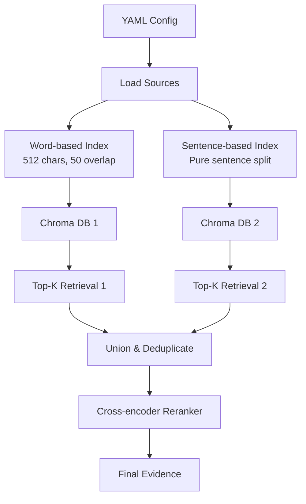

# Dual-Index Chroma RAG Pipeline with Reranking

## Overview

Create `retrieval_core/` folder extending mwe5 pipeline with:

- Chroma vector database (replacing in-memory SimpleVectorStore)
- Dual embedding indexes: word-based (512 chars, 50 overlap) + sentence-based (pure sentence splitting)
- YAML-based source configuration (files + URLs)
- Top-k retrieval from both indexes
- Cross-encoder reranking (ms-marco-MiniLM-L-6-v2, configurable)

## Architecture



## File Structure

```
retrieval_core/
├── __init__.py
├── config/
│   ├── __init__.py
│   └── sources.yaml          # Source configuration (files + URLs)
├── index_builder.py           # Dual-index building with Chroma
├── retriever.py               # Dual-index retrieval + reranking
├── pipeline.py                 # Extended pipeline (based on mwe5)
└── README.md
```

## Implementation Details

### 1. Source Configuration (`config/sources.yaml`)

- Support both `file` and `url` source types
- File sources: local paths with glob patterns
- URL sources: web URLs with optional caching
- Structure:
```yaml
sources:
  - type: "file"
    path: "evidence/sources/"
    patterns: ["*.md", "*.txt", "*.pdf"]
  - type: "url"
    url: "https://example.com/docs"
    cache_dir: "evidence/cache/"
```


### 2. Dual Index Builder (`index_builder.py`)

- **Word-based index**: Use `SentenceSplitter` with `chunk_size=512`, `chunk_overlap=50` (characters)
- **Sentence-based index**: Use `SentenceSplitter` with no size limit (pure sentence splitting)
- Both indexes stored in separate Chroma collections
- Preserve metadata (source_id, source_type, file_path, etc.)
- Functions:
                - `load_sources_from_yaml(config_path: Path) -> list[Document]`
                - `build_word_index(documents: list[Document]) -> ChromaVectorStore`
                - `build_sentence_index(documents: list[Document]) -> ChromaVectorStore`
                - `build_dual_indexes(config_path: Path, persist_dir: Path) -> tuple[ChromaVectorStore, ChromaVectorStore]`

### 3. Dual Retriever with Reranking (`retriever.py`)

- Retrieve top-k from both indexes
- Union strategy: merge results, smart deduplication (remove only exact duplicates)
- **Smart Deduplication**: Remove chunks that have identical `source_id` AND identical text content. Keep overlapping chunks (different text even if from same source)
- Rerank using cross-encoder (ms-marco-MiniLM-L-6-v2 by default, configurable)
- Functions:
                - `DualIndexRetriever(word_index, sentence_index, reranker_model: str)`
                - `retrieve_dual(query: str, top_k_per_index: int) -> list[dict]`
                - `_union_and_deduplicate(results1: list, results2: list) -> list[dict]` - removes exact duplicates (same source_id + identical text)
                - `_rerank(query: str, candidates: list[dict], top_k: int) -> list[dict]`

### 4. Extended Pipeline (`pipeline.py`)

- Based on `mwe5_full_pipeline_2students.py`
- Replace `create_sample_evidence_index()` with dual-index building from YAML
- Replace `EvidenceRetriever` with `DualIndexRetriever`
- Add timing for reranking step
- Maintain all execution modes (sequential, batched, async)

### 5. Dependencies

- Add `sentence-transformers` for cross-encoder reranking
- Ensure `chromadb` is available (already in pyproject.toml)
- Add `llama-index-vector-stores-chroma` integration

## Key Design Decisions

1. **Chroma Collections**: Separate collections for word-based and sentence-based indexes
2. **Reranker Model**: Default to `ms-marco-MiniLM-L-6-v2`, make configurable via environment variable
3. **Smart Deduplication**: Remove only exact duplicates (same `source_id` AND identical text content). Keep overlapping chunks that provide different context, even if they share some text or come from the same source.
4. **Top-K Strategy**: Retrieve top_k from each index, then rerank combined results
5. **Backward Compatibility**: Keep existing retriever interface where possible
6. **Query Embedding**: Student answer + criterion description combined into single query string, embedded once, used against both indexes

## Configuration

- Reranke